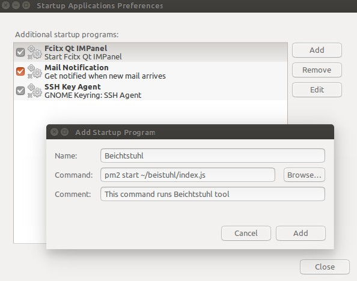

## BEICHTSTUHL
A node.js tool made for beichtstuhl project.

### Prerequisites
This tool has been developed on [Ubuntu 16.04 (Xenial Xerus)](http://releases.ubuntu.com/16.04/), the following `System Requirements`, `Installation` and `instructions` are only for this Operating System.  
It is only referred here, in no other places, the relation of this tool to Ubuntu 16.04 will be mentioned.
#### NOTE:
Since we had some issues on the deployment, where recording audio and video with filters was not good on deployment device, we had to add some fast implementations to the script. we used `rubberband` (to download `$ apt-get install rubberband-cli`) to split the audio, change the pitch and recombine it. The scripts/ dir is still placeholder for all scripting possibilities.  

**reverting to:** `a465fc09cf76077b813e5f1add7fd1a7c73019f1` which is [Mapping all needed keys](/commit/a465fc09cf76077b813e5f1add7fd1a7c73019f1) commit will get the tool back to its orginal state.
## System Requirements
Root privileges may be required, adding `$ sudo _command_` before every command will fix it.
### 1- node.js (6.9.x)
#### installation:  
  install node: `$ apt-get install nodejs-legacy`  
  install npm: `$ sudo apt-get install npm`

#### Changing node version:
  To change `node` version, node version management will be required. It is likely to use ([n](https://github.com/tj/n)).  
  `$ npm install -g n`  
  `$ n 6.9.4`

### 2- [pm2](https://github.com/Unitech/pm2)

install: `$ npm install pm2 -g`

### 3- [ffmpeg](https://www.ffmpeg.org/)
install: `$ apt-get install ffmpeg`

### 4- [mplayer](http://www.mplayerhq.hu/)
install: `$ apt-get install mplayer`  
configurations:
- Copy the file `_files/input.con` into `~/.mplayer/input.conf` to disable key control.

### 5- [osd_cat](https://linux.die.net/man/1/osd_cat)
 install: `$ apt-get install xosd-bin`

### 6- Java
The latest java is required to run node `child_process`. You can skip it if you have the latest version.
- `$ add-apt-repository ppa:webupd8team/java`  
- `$ apt-get update`
- `$ apt-get install oracle-java8-installer`

## Installation

- Clone the repository locally.
- run `$ npm install `

## Run
Run `$ npm start ` inside repository directory.
## Adding Beichtstuhl to startup
It is possible to start Beichtstuhl with boot:  
Open `Startup Applications`, click `add`

`pm2 start ~/beistuhl/index.js`  
assuming that the local repository is cloned in `/home/user/`  
To stop Beichtstuhl from running in daemon mode (background mode) run: `pm2 stop ~/beistuhl/index.js`

## Known Issues
- .sh files: For some reasons, spawned child processes were not able to handle mirroring or recording for more than few seconds (they were freezing), it should be separated files for handling processes.
